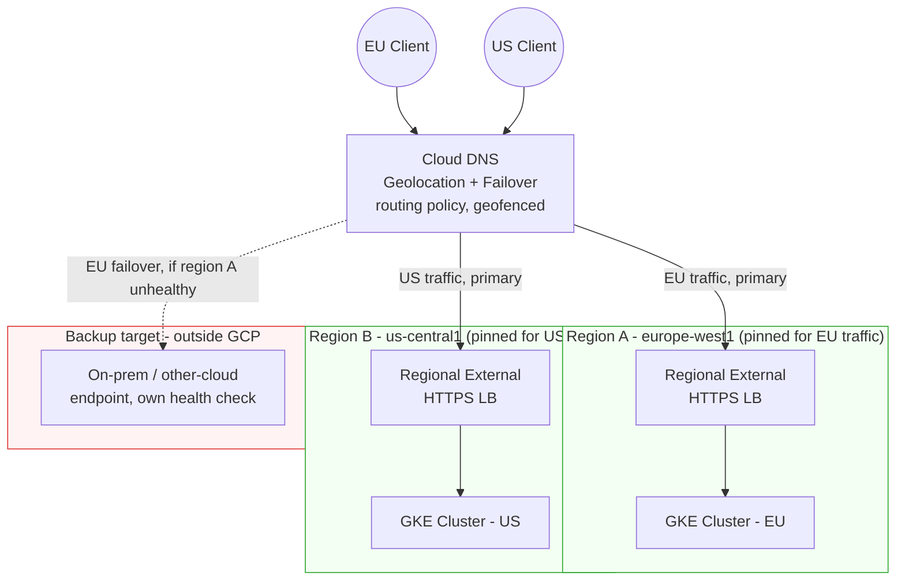

# Multi-Region L7 HTTPS Failover with Cloud DNS

A GCP reference architecture for routing HTTPS traffic to one of two regional
GKE clusters, using Cloud DNS geolocation + failover routing policies to (a)
pin normal traffic to a specific region for data-residency reasons, and (b)
fail over to a healthy region -- including a region outside GCP -- when the
primary is down.

This repo currently implements the design using `gcloud` only. A Terraform
implementation is planned (see [Roadmap](#roadmap)).

---

## Why DNS failover, and why not just a Global External HTTPS LB

For a plain "route to whichever GKE region is healthy" requirement, a single
**Global External HTTPS LB with zonal NEGs from both clusters attached to one
backend service** is the better answer, not this repo's approach. GKE
container-native NEGs carry a real health check, so the LB automatically
stops sending traffic to an unhealthy region's backends and routes to the
other region -- one anycast IP, failover in single-digit seconds, one
forwarding rule to pay for. If that's your whole requirement, use that
instead of what's in this repo.

DNS failover earns its place when either of these is actually true, which
they are for the scenario this repo targets:

1. **Data residency / traffic pinning.** A single global LB routes by
   proximity to the nearest *healthy* backend -- it doesn't give you a hard
   guarantee that, say, EU traffic is served only from EU infrastructure
   under normal conditions. Cloud DNS's geolocation routing policy (with
   geofencing enabled) does: it pins traffic to the region mapped to the
   client's location and does **not** silently fail over to another
   geolocation just because that's easier -- it returns the pinned region's
   answer unless that entire geolocation's endpoints fail health checks.
   That's a real, common requirement (regulatory, contractual, or just "we
   don't want EU customer traffic hairpinning through US infrastructure even
   during a partial degradation").

2. **A backup target that isn't a GCP NEG-eligible backend at all** -- an
   on-prem data center or a different cloud provider's own load balancer,
   with no private network path (VPN/Interconnect) into that environment.
   GCP does support hybrid NEGs for on-prem/other-cloud backends on a global
   LB, but only for targets reachable over a private VPC extension -- Google's
   health check probers need to reach the endpoint privately. If that
   connectivity doesn't exist (a public endpoint sitting in AWS/Azure with
   its own independent load balancer, or an on-prem site with no
   Interconnect), you can't attach it as a backend at all. Cloud DNS doesn't
   care what's behind the IP -- it just needs a forwarding rule (for the GCP
   side) and returns the backup IP when the primary is unhealthy. That makes
   it the practical option for tying a GCP region to a non-GCP failover
   target, not just the cheaper one.

| Approach | Failover mechanism | Works across clouds/on-prem? | Pins traffic to a region under normal ops? | Failover latency |
|---|---|---|---|---|
| Global External HTTPS LB, multi-region NEGs | LB-level health check, single anycast IP | No -- NEGs must be GCP-native or privately reachable hybrid NEGs | No -- routes by proximity to nearest healthy backend | Seconds |
| **Cloud DNS geolocation + failover** (this repo) | Client re-resolves once Cloud DNS's health check on the primary fails | Yes -- backup can be any IP, including outside GCP | Yes -- geofencing pins traffic to the mapped region | Tens of seconds (health check detection + TTL) |
| Multi-cluster Gateway / Anthos Service Mesh | Mesh-aware routing across a GKE Fleet | GCP/Anthos-attached clusters only | Not its purpose -- built for east-west traffic management | Varies |

The tradeoff for using DNS is the one thing DNS-based routing can never fully
avoid: it depends on the client re-resolving, so failover time is measured in
tens of seconds rather than the single-digit-second failover a proxy-based LB
gets by just dropping an unhealthy backend from rotation. That's the real
cost of buying region-pinning and cross-provider portability with this
pattern -- worth stating plainly rather than glossing over.

## Architecture



Each region's stack is fully independent -- its own regional external HTTPS
LB, its own certs, its own config surface. Cloud DNS is the only thing tying
them together, which is exactly the point: a bad config push to the EU LB
can't touch the US stack, and the backup target doesn't need to be a GCP
resource at all.

## How failover actually behaves (and the latency tradeoff)

Cloud DNS's `FAILOVER` routing policy reads the health state of the backend
service behind the forwarding rule you reference as primary -- it isn't
running independent probes. Total time for a client to actually reach the
backup breaks into two pieces:

1. **Health check detection** -- `check_interval x unhealthy_threshold`. With
   a 5-10s interval and 2-3 consecutive failures, that's roughly 10-30s
   before Cloud DNS's view of the primary flips to unhealthy.
2. **DNS caching** -- Google's guidance for primary/backup failover is a TTL
   of 30s or less specifically so resolvers re-query quickly. That covers
   compliant resolvers; it doesn't cover already-open connections/keep-alives
   (which don't re-resolve until they reconnect) or clients/resolvers that
   don't honor TTL.

Combined, **30-60 seconds is a realistic number** for new connections with an
aggressive health check and a 30s TTL -- not a guarantee, and there's a tail
risk from non-compliant caching that no TTL setting fully removes.

## Repo layout

```
.
├── README.md
├── scripts/
│   ├── 01-create-regional-lb.sh            # regional ext. HTTPS LB + health check, per region
│   ├── 02-create-dns-geo-failover-record.sh
│   └── 03-test-failover.sh
├── manifests/
│   └── sample-app.yaml                     # Deployment + Service (NEG-enabled)
└── terraform/
    └── README.md                           # "in progress" placeholder
```

## Implementation walkthrough (gcloud)

Assumes two GKE clusters (`cluster-eu` in `europe-west1`, `cluster-us` in
`us-central1`) each running the same Deployment/Service, and a Cloud DNS
managed zone for your domain. The backup target for this walkthrough is
modeled as a third static IP, standing in for an on-prem or other-cloud
endpoint -- swap in whatever's actually behind it.

### 1. Reserve a static IP and create the regional external HTTPS LB, per region

```bash
REGION=europe-west1 \
NAME=app-region-eu \
NEG_NAME=cluster-eu-neg \
ZONE=europe-west1-a \
DOMAIN=eu.app.example.com \
./scripts/01-create-regional-lb.sh
```

Repeat for `us-central1` / `cluster-us` with `NAME=app-region-us`.

### 2. Create the Cloud DNS geolocation + failover record

```bash
ZONE=app-zone \
DOMAIN=app.example.com. \
./scripts/02-create-dns-geo-failover-record.sh
```

### 3. Test the failover

```bash
REGION=europe-west1 \
BACKEND_SERVICE=app-region-eu-bs \
ORIGINAL_HEALTH_CHECK=app-region-eu-hc \
DOMAIN=eu.app.example.com \
./scripts/03-test-failover.sh
```

## Roadmap

- [ ] Terraform module covering everything in `scripts/`
- [ ] GitHub Actions workflow that runs `03-test-failover.sh` against a
      staging zone on a schedule
- [ ] Cloud Monitoring alert policy on health-check state transitions
- [ ] Independent uptime check on the non-GCP backup target, since Cloud DNS
      can't health-check it directly
