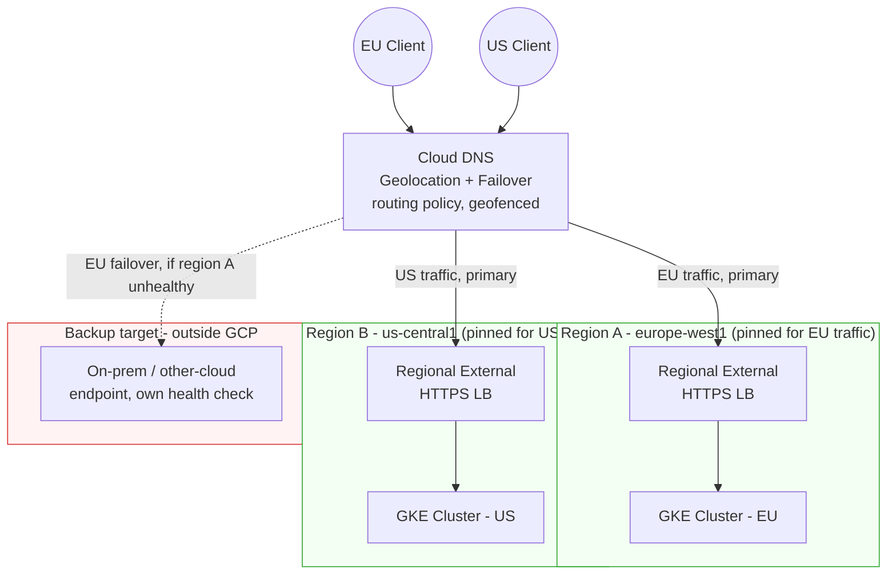

# Multi-Region L7 HTTPS Failover with Cloud DNS

A GCP reference architecture for routing HTTPS traffic to one of two regional
GKE clusters, using Cloud DNS geolocation + failover routing policies to (a)
pin normal traffic to a specific region for data-residency reasons, and (b)
fail over to a healthy region — including a region outside GCP — when the
primary is down.

This repo currently implements the design using `gcloud` only. A Terraform
implementation is planned (see [Roadmap](#roadmap)).

---

## Why DNS failover, and why not just a Global External HTTPS LB

For a plain "route to whichever GKE region is healthy" requirement, a single
**Global External HTTPS LB with zonal NEGs from both clusters attached to one
backend service** is the better answer, not this repo's approach. GKE
container-native NEGs carry a real health check, so the LB automatically
stops sending traffic to an unhealthy region's backends and routes to the
other region — one anycast IP, failover in single-digit seconds, one
forwarding rule to pay for. If that's your whole requirement, use that
instead of what's in this repo.

DNS failover earns its place when either of these is actually true, which
they are for the scenario this repo targets:

1. **Data residency / traffic pinning.** A single global LB routes by
   proximity to the nearest *healthy* backend — it doesn't give you a hard
   guarantee that, say, EU traffic is served only from EU infrastructure
   under normal conditions. Cloud DNS's geolocation routing policy (with
   geofencing enabled) does: it pins traffic to the region mapped to the
   client's location and does **not** silently fail over to another
   geolocation just because that's easier — it returns the pinned region's
   answer unless that entire geolocation's endpoints fail health checks.
   That's a real, common requirement (regulatory, contractual, or just "we
   don't want EU customer traffic hairpinning through US infrastructure even
   during a partial degradation").

2. **A backup target that isn't a GCP-native LB backend at all** — an
   on-prem data center or a different cloud provider's own load balancer.
   Attaching that to a *Global External HTTPS LB* as a backend requires a
   hybrid connectivity NEG, which only works for targets reachable over a
   private network path (Cloud VPN or Interconnect) — Google's health check
   probers need to reach the endpoint privately. If that connectivity
   doesn't exist (a public endpoint sitting in AWS/Azure with its own
   independent load balancer, or an on-prem site with no Interconnect), you
   can't attach it as an LB backend at all. Cloud DNS sidesteps this
   entirely: since Feb 2025, Cloud DNS supports **health checks for external
   endpoints** in public zones — it probes any public IP:port directly over
   the internet (three source regions you choose, three probers per region,
   nine probes total), with no requirement that the target be a GCP
   resource or privately reachable. That's what makes DNS failover the
   practical option for a public-facing service with a non-GCP backup: the
   health-check mechanism only needs the target to be publicly reachable,
   not privately connected to your VPC.

| Approach | Failover mechanism | Works across clouds/on-prem? | Pins traffic to a region under normal ops? | Failover latency |
|---|---|---|---|---|
| Global External HTTPS LB, multi-region NEGs | LB-level health check, single anycast IP | No — NEGs must be GCP-native, or a hybrid NEG requiring private connectivity | No — routes by proximity to nearest healthy backend | Seconds |
| **Cloud DNS geolocation + failover** (this repo) | Cloud DNS's own external-endpoint health check on the primary IP fails, client re-resolves | Yes — any public IP:port, GCP or not, no private connectivity needed | Yes — geofencing pins traffic to the mapped region | ~90-120s (30s minimum check interval + TTL) |
| Multi-cluster Gateway / Anthos Service Mesh | Mesh-aware routing across a GKE Fleet | GCP/Anthos-attached clusters only | Not its purpose — built for east-west traffic management | Varies |

The tradeoff for using DNS is the one thing DNS-based routing can never fully
avoid: it depends on the client re-resolving, and the health check itself has
a 30-second floor, so failover time is measured in minutes rather than the
single-digit-second failover a proxy-based LB gets by just dropping an
unhealthy backend from rotation. That's the real cost of buying
region-pinning and cross-provider portability with this pattern — worth
stating plainly rather than glossing over.

## Architecture



Each region's stack is fully independent — its own regional external HTTPS
LB, its own certs, its own config surface. Cloud DNS is the only thing tying
them together, which is exactly the point: a bad config push to the EU LB
can't touch the US stack, and the backup target doesn't need to be a GCP
resource at all.

## How failover actually behaves (and the latency tradeoff)

This is a public zone, so Cloud DNS uses **health checks for external
endpoints** (GA since February 2025): it probes each target IP:port
directly over the public internet from three Google Cloud source regions
you choose, three probers per region (nine probes total per endpoint). This
is a distinct mechanism from the health checks used for internal load
balancers in private zones, and it comes with a different, harder floor on
speed:

1. **Health check detection.** The check interval for external-endpoint
   health checks has a hard floor of **30 seconds** (the allowed range is
   30-300s) — there's no way to configure a faster probe than that for a
   public zone. With the minimum 30s interval and a 2-3 consecutive-failure
   threshold, detection realistically takes **60-90 seconds**, not the
   10-30s that's achievable with the faster health checks available to
   internal load balancers.
2. **DNS caching.** A 30s TTL is standard guidance for fast failover, which
   covers compliant resolvers; it doesn't cover already-open
   connections/keep-alives (they don't re-resolve until they reconnect), or
   clients/resolvers that don't honor TTL.

Combined, **90-120 seconds is a realistic floor** for new connections to
actually reach the backup, once you account for both the 30s interval floor
and a TTL on top of it. This is worth stating precisely rather than rounding
down to a nicer-sounding "30-60s" figure: the 30-second minimum on external
endpoint health checks is a hard product constraint, not a tuning choice,
and it's the single biggest factor in this architecture's failover time.

## Repo layout

```
.
├── README.md
├── scripts/
│   ├── 01-create-regional-lb.sh            # regional ext. HTTPS LB + health check, per region
│   ├── 02-create-dns-geo-failover-record.sh
│   └── 03-test-failover.sh
├── manifests/
│   └── sample-app.yaml                     # Deployment + Service (NEG-enabled)
└── terraform/
    └── README.md                           # "in progress" placeholder
```

## Implementation walkthrough (gcloud)

Assumes two GKE clusters (`cluster-eu` in `europe-west1`, `cluster-us` in
`us-central1`) each running the same Deployment/Service, and a Cloud DNS
managed zone for your domain. The backup target for this walkthrough is
modeled as a third static IP, standing in for an on-prem or other-cloud
endpoint — swap in whatever's actually behind it.

### 1. Reserve a static IP and create the regional external HTTPS LB, per region

```bash
REGION=europe-west1
CLUSTER=cluster-eu
NAME=app-region-eu

gcloud compute addresses create ${NAME}-ip \
  --region=${REGION}

gcloud compute health-checks create https ${NAME}-hc \
  --region=${REGION} \
  --port=443 \
  --request-path=/healthz \
  --check-interval=10s \
  --unhealthy-threshold=3

gcloud compute backend-services create ${NAME}-bs \
  --load-balancing-scheme=EXTERNAL_MANAGED \
  --protocol=HTTPS \
  --region=${REGION} \
  --health-checks=${NAME}-hc

gcloud compute backend-services add-backend ${NAME}-bs \
  --region=${REGION} \
  --network-endpoint-group=${CLUSTER}-neg \
  --network-endpoint-group-zone=${REGION}-a \
  --balancing-mode=RATE \
  --max-rate-per-endpoint=100

gcloud compute ssl-certificates create ${NAME}-cert \
  --region=${REGION} \
  --domains=eu.app.example.com

gcloud compute target-https-proxies create ${NAME}-proxy \
  --region=${REGION} \
  --url-map=${NAME}-urlmap \
  --ssl-certificates=${NAME}-cert

gcloud compute forwarding-rules create ${NAME}-fr \
  --region=${REGION} \
  --load-balancing-scheme=EXTERNAL_MANAGED \
  --address=${NAME}-ip \
  --target-https-proxy=${NAME}-proxy \
  --ports=443
```

Repeat for `us-central1` / `cluster-us` with `NAME=app-region-us`.

### 2. Create the Cloud DNS geolocation + failover record

**This is a public zone**, so Cloud DNS uses **health checks for external
endpoints** — it probes a plain IP:port directly over the internet, rather
than reading a load balancer's internal backend-service health state (that
forwarding-rule-reference mechanism is only for internal load balancers in
private zones). Create the standalone health check first, then point the
records at it:

```bash
ZONE=app-zone
EU_LB_IP=$(gcloud compute addresses describe app-region-eu-ip --region=europe-west1 --format="value(address)")
US_LB_IP=$(gcloud compute addresses describe app-region-us-ip --region=us-central1 --format="value(address)")

# Standalone health check probing the IP:port directly -- not attached to
# any backend service. --check-interval has a hard floor of 30s for this
# health check type. Probes run from the three listed source regions, three
# probers per region (nine probes total per endpoint).
gcloud beta compute health-checks create https app-hc \
  --global \
  --check-interval=30 \
  --source-regions=europe-west1,us-central1,us-east1 \
  --port=443 \
  --request-path=/healthz

gcloud dns record-sets create app.example.com. \
  --zone=${ZONE} \
  --type=A \
  --ttl=30 \
  --routing-policy-type=GEO \
  --enable-geo-fencing \
  --routing-policy-item="location=europe-west1,rrdatas=${EU_LB_IP},external_endpoints=${EU_LB_IP}" \
  --routing-policy-item="location=us-central1,rrdatas=${US_LB_IP},external_endpoints=${US_LB_IP}" \
  --health-check=app-hc
```

For the failover leg to a non-GCP backup (on-prem or another cloud), add a
`FAILOVER` policy scoped to the EU entry — the backup is just another public
IP, checked by the same health check:

```bash
BACKUP_IP=203.0.113.10   # on-prem or other-cloud public IP

gcloud dns record-sets create eu.app.example.com. \
  --zone=${ZONE} \
  --type=A \
  --ttl=30 \
  --routing-policy-type=FAILOVER \
  --routing-policy-primary-data="${EU_LB_IP}" \
  --routing-policy-backup-data-type=GEO \
  --routing-policy-backup-item="location=europe-west1,rrdatas=${BACKUP_IP},external_endpoints=${BACKUP_IP}" \
  --backup-data-trickle-ratio=0 \
  --health-check=app-hc
```

Notes:
- The health check itself (`gcloud beta compute health-checks create`) is
  still under the `beta` command group as of this writing — run
  `gcloud components install beta` if you don't have it. The DNS record-set
  commands are not beta.
- `rrdatas` and `external_endpoints` are both set to the same IP here —
  `rrdatas` is what Cloud DNS actually returns to clients, `external_endpoints`
  is what tells Cloud DNS which IP to associate with the referenced health
  check's results for that routing policy item.
- The same `app-hc` health check works identically whether the target is a
  GCP regional LB IP or the on-prem/other-cloud backup IP — Cloud DNS is
  just probing an IP:port over the public internet either way. This is the
  concrete mechanism behind the "works uniformly across providers" point
  above.
- `--enable-geo-fencing` is what keeps EU traffic in EU under normal
  conditions instead of silently drifting to whichever region is closest.
- The 30-second minimum check interval (see the latency section above)
  applies here — there's no way to configure faster detection than that for
  a public-zone external endpoint.

### 3. Test the failover

```bash
REGION=europe-west1 \
BACKEND_SERVICE=app-region-eu-bs \
ORIGINAL_HEALTH_CHECK=app-region-eu-hc \
DOMAIN=eu.app.example.com \
./scripts/03-test-failover.sh
```

Expect the flip to take roughly 90-120 seconds, not 30-60 — the script
breaks the LB's own backend health check, which in turn makes Cloud DNS's
external-endpoint health check on that LB's public IP start failing, and
that outer check has the 30-second minimum interval described above.

## Roadmap

- [ ] Terraform module covering everything in `scripts/`
- [ ] GitHub Actions workflow that runs `03-test-failover.sh` against a
      staging zone on a schedule
- [ ] Cloud Monitoring alert policy on health-check state transitions

## References

- [DNS routing policies and health checks](https://cloud.google.com/dns/docs/routing-policies-overview) —
  geolocation, failover, and WRR policies; the distinction between health
  checks for internal load balancers (private zones) and external endpoints
  (public zones), and geofencing behavior.
- [Configure DNS routing policies and health checks](https://cloud.google.com/dns/docs/configure-routing-policies) —
  exact `gcloud` syntax for both mechanisms; source for the commands in
  `scripts/02-create-dns-geo-failover-record.sh`, including the 30-300s
  check-interval range for external endpoints.
- [Container-native load balancing](https://cloud.google.com/kubernetes-engine/docs/concepts/container-native-load-balancing) —
  how GKE NEGs get real backend health checks, referenced in the "why not a
  Global LB" section above.
- [Container-native load balancing through standalone zonal NEGs](https://cloud.google.com/kubernetes-engine/docs/how-to/standalone-neg) —
  attaching a GKE Service's NEG to a manually-configured backend service,
  what `01-create-regional-lb.sh` relies on.
- [Hybrid connectivity NEGs overview](https://cloud.google.com/load-balancing/docs/negs/hybrid-neg-concepts) —
  why on-prem/other-cloud backends need private connectivity to be attached
  as a Global LB backend, the gap this repo's DNS-based approach avoids.
