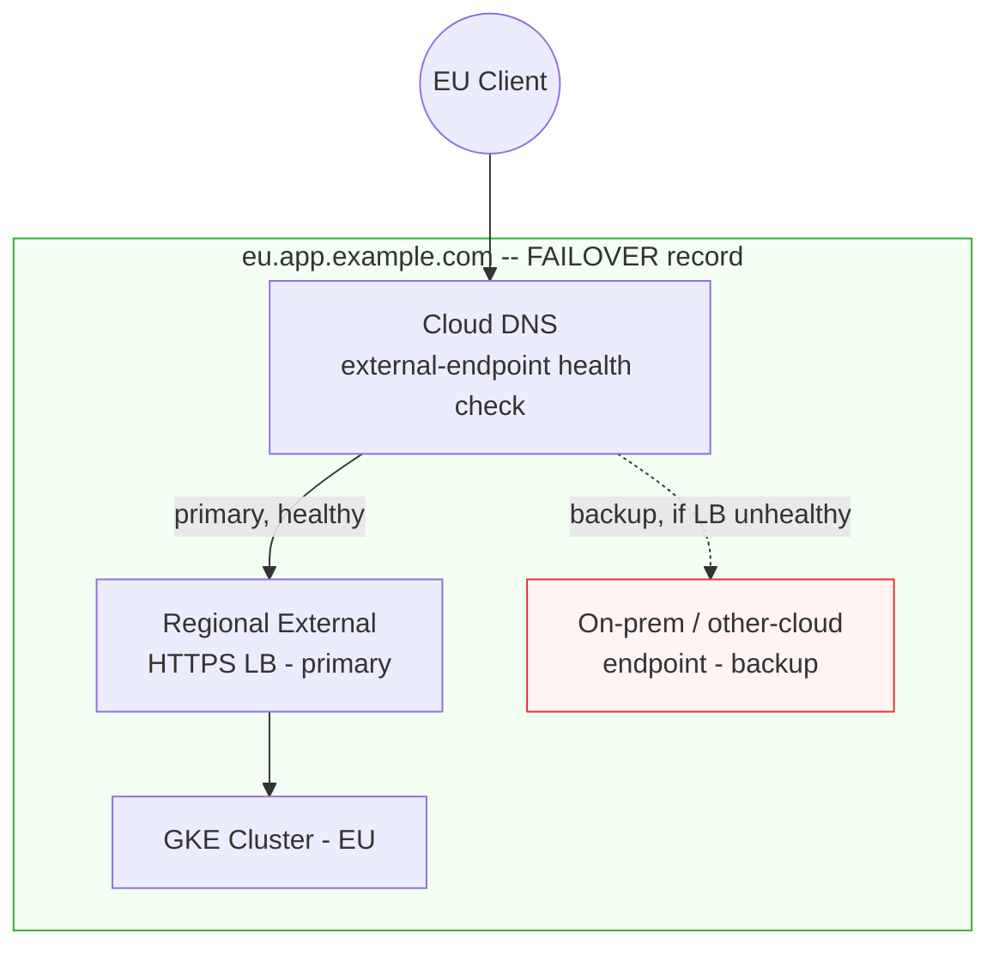

# Regional HTTPS Failover to a Non-GCP Backup, with Cloud DNS

A GCP reference architecture for putting a publicly reachable, non-GCP
disaster-recovery target (on-prem or another cloud) behind a regional GKE
cluster's HTTPS endpoint, using a Cloud DNS FAILOVER routing policy with
health checks for external endpoints.

**What this is not:** a single hostname that both geo-pins clients to their
nearest region AND fails over per region. Cloud DNS's GEO and FAILOVER
routing policies are separate policy types that cannot be nested -- a GEO
policy item cannot itself own an independent FAILOVER policy. An earlier
version of this README implied otherwise; that was wrong, and is corrected
below. What this repo actually implements: **one independent FAILOVER
record per region** (`eu.app.example.com`, `us.app.example.com`, ...), each
pinning that region's traffic to its own GCP stack under normal conditions
and failing over to that region's own non-GCP backup if the GCP stack goes
unhealthy.

This repo implements the design using `gcloud` (see `scripts/`) and,
equivalently, Terraform (see `terraform/`).

---

## What this repository demonstrates

1. A regional GKE cluster exposed through a regional external Application
   Load Balancer with container-native (NEG) backends.
2. Cloud DNS health checks for external endpoints (GA since Feb 2025) --
   probing a plain IP:port over the public internet, not a GCP backend's
   internal health state -- as the mechanism that lets a FAILOVER record's
   backup target be a non-GCP IP.
3. Why that matters: a Global External HTTPS LB with hybrid NEGs can also
   reach non-GCP backends, but only over a private network path (VPN or
   Interconnect). Cloud DNS's external-endpoint health check needs no such
   connectivity -- any publicly reachable IP works.
4. DNS-based failover has materially higher client-observed recovery time
   than LB-level failover, and a real, quantifiable reason why (a hard
   30-second health-check floor for this check type, on top of DNS TTL).
5. A real limitation in Cloud DNS's routing-policy model: GEO and FAILOVER
   don't compose into a single record, which shaped the final design here.

## Why not just a Global External HTTPS LB?

For a plain "route to whichever GKE region is healthy" requirement *within
GCP*, a single **Global External HTTPS LB with zonal NEGs from both
clusters attached to one backend service** is the better answer, not this
repo's approach -- one anycast IP, LB-level health checks, failover in
single-digit seconds. If your backup target is also a GCP resource, use
that instead.

This repo's approach earns its place specifically because the backup target
is **not** a GCP-attachable backend: an on-prem data center or another
cloud provider's own load balancer, with no private network path (VPN or
Interconnect) into that environment. Attaching that to a Global LB requires
a hybrid connectivity NEG, which only works when Google's health check
probers can reach the target *privately*. If that connectivity doesn't
exist, you can't attach it as an LB backend at all. Cloud DNS's
external-endpoint health check sidesteps this: it probes any public IP:port
directly over the internet (three source regions you choose, three probers
per region, nine probes total), with no requirement that the target be
privately reachable.

| Approach | Failover mechanism | Works with a non-GCP backup? | Failover latency |
|---|---|---|---|
| Global External HTTPS LB, multi-region NEGs | LB-level health check, single anycast IP | Not directly over the public internet -- needs a hybrid NEG with private connectivity | Seconds |
| **Cloud DNS FAILOVER, per region** (this repo) | Cloud DNS's own external-endpoint health check, client re-resolves | Yes -- any public IP:port, GCP or not | ~90-120s (30s minimum check interval + TTL), see below -- and only while at least one target answers, see Known limitations |
| Multi-cluster Gateway / Anthos Service Mesh | Mesh-aware routing across a GKE Fleet | GCP/Anthos-attached clusters only | Varies -- not built for this |

## Architecture



Each region gets its own hostname and its own independent FAILOVER record
like this one. There is no shared top-level record combining regions --
see the note at the top of this README for why, and the Roadmap for how a
single entry point could be layered on top if needed.

## How failover actually behaves (and the latency tradeoff)

This is a public zone, so Cloud DNS uses **health checks for external
endpoints** (GA since February 2025) -- a different data source from
private-zone failover, and it's worth being precise about which one this
repo uses:

- **Private zones** (`--enable-health-checking` / `internal_load_balancers`
  in Terraform): Cloud DNS reads the internal load balancer's own
  control-plane health signal directly. No standalone probe resource is
  created. This mechanism cannot target a public IP at all.
- **Public zones** (`--health-check=NAME` / `external_endpoints` in
  Terraform -- **what this repo uses**): Cloud DNS actively probes each
  target `IP:port` over the internet from three Google Cloud source
  regions you choose (three probers per region, nine probes total). An
  HTTP/HTTPS probe must return `200` to count as healthy.

The primary target is written as a forwarding-rule reference
(`app-region-eu-fr@europe-west1`). In a public zone, that's only how
`gcloud` resolves the VIP to put in the record -- the health signal is
still the standalone health check probing that VIP over the public
internet, **not** the LB's backend-service health. A separate, *inner*
health check (`app-region-eu-hc`, HTTP `:8080` `/healthz` against the
GKE NEG) only decides whether the regional LB itself has healthy pods to
serve traffic from -- Cloud DNS never sees that check. Failover happens
when the *outer* health check (`app-region-eu-dns-hc`, HTTPS `:443`
`/healthz` against the VIP) stops getting a `200`, which is why
`03-test-failover.sh` breaks the inner check: that makes the LB stop
serving `200`s, which then fails the outer, DNS-facing check.

1. **Health check detection.** The check interval for this health check
   type has a hard floor of **30 seconds** (allowed range 30-300s) -- there
   is no way to configure faster probing for a public zone. With the
   minimum interval and a 2-3 consecutive-failure threshold, detection
   realistically takes on the order of 60-90 seconds.
2. **DNS caching.** A 30-second TTL is standard guidance for fast failover
   and covers compliant resolvers; it doesn't cover already-open
   connections/keep-alives (which don't re-resolve until they reconnect),
   or resolvers/clients that don't honor TTL.

Combined: **expect failover for new connections on the order of roughly 1-2
minutes**, with the 30-second health-check floor as the dominant, hard
constraint. Treat that as a realistic order of magnitude, not a precise
SLA -- actual client-observed recovery also depends on probe timing,
threshold configuration, resolver caching behavior, and connection reuse,
several of which aren't fully under your control.

## Known limitations

- **Fail-open on total outage.** If every target in a FAILOVER policy is
  unhealthy -- both the primary VIP and the backup IP -- Cloud DNS still
  returns those IPs rather than serving `SERVFAIL`. Clients get an address
  that doesn't work. This is documented platform behavior
  ([source](https://cloud.google.com/dns/docs/routing-policies-overview)),
  not something this repo's configuration can disable.
- **The non-GCP backup's firewall must allow any source IP** on
  `:443`/`/healthz`. Cloud DNS's external-endpoint probes don't originate
  from the fixed `35.191.0.0/16` / `130.211.0.0/22` ranges that GCP load
  balancers use for their own backend health checks -- those ranges only
  apply to the *inner* NEG-facing check, not to Cloud DNS's outer probe.
  Locking the backup's firewall down to those ranges will make it look
  permanently unhealthy.
- **One health check per region, not shared.** Each region's FAILOVER
  record uses its own `${NAME}-dns-hc` health check with a `--host` set to
  that region's domain, rather than one shared global check -- a shared
  check can only carry one `Host` header, which would be wrong for every
  region but one.

## Repo layout

```
.
├── README.md
├── scripts/
│   ├── 01-create-regional-lb.sh              # proxy-only subnet, firewall, regional ext. HTTPS LB
│   ├── 02-create-regional-failover-record.sh # FAILOVER record for one region
│   └── 03-test-failover.sh
├── manifests/
│   └── sample-app.yaml                       # Deployment + Service (NEG-enabled), plain HTTP :8080
└── terraform/
    ├── main.tf, variables.tf, outputs.tf     # root module: one instance per entry in var.regions
    ├── modules/regional-lb/                  # Terraform equivalent of 01-create-regional-lb.sh
    ├── modules/dns-failover/                 # Terraform equivalent of 02-create-regional-failover-record.sh
    └── REFERENCES.md                         # doc citations for every resource/argument choice
```

## Implementation walkthrough (gcloud)

Assumes a GKE cluster (`cluster-eu` in `europe-west1`) running the sample
app, a VPC network with a subnet for backends already set up, and a Cloud
DNS managed zone for your domain. You'll need a self-managed SSL cert/key
pair on disk -- regional external Application LBs don't support Google-managed
certs (see the note in `01-create-regional-lb.sh`).

### 1. Create the regional external HTTPS LB (proxy-only subnet, firewall rule, LB)

```bash
REGION=europe-west1 \
NAME=app-region-eu \
NEG_NAME=sample-app-https-neg \
ZONE=europe-west1-a \
NETWORK=default \
PROXY_SUBNET_RANGE=10.129.0.0/23 \
CERT_FILE=./eu-cert.pem \
KEY_FILE=./eu-key.pem \
./scripts/01-create-regional-lb.sh
```

Repeat for `us-central1` / `cluster-us` with `NAME=app-region-us` and a
different `PROXY_SUBNET_RANGE` (proxy-only subnets are per-region, but the
range still needs to not collide with anything else in that region's VPC).

### 2. Create the FAILOVER record for that region

```bash
ZONE=app-zone \
DOMAIN=eu.app.example.com. \
REGION=europe-west1 \
NAME=app-region-eu \
PRIMARY_FORWARDING_RULE=app-region-eu-fr \
BACKUP_IP=203.0.113.10 \
./scripts/02-create-regional-failover-record.sh
```

Repeat for `us.app.example.com` with that region's `NAME`, forwarding rule,
and backup IP. Each region gets its **own** `${NAME}-dns-hc` health check
(not a shared one) so its `--host` can match that region's domain -- see
Known limitations.

### 3. Test the failover

```bash
REGION=europe-west1 \
BACKEND_SERVICE=app-region-eu-bs \
ORIGINAL_HEALTH_CHECK=app-region-eu-hc \
DOMAIN=eu.app.example.com \
BACKUP_IP=203.0.113.10 \
./scripts/03-test-failover.sh
```

Expect the flip to take roughly 90-120 seconds -- the script breaks the
LB's own backend health check, which in turn makes Cloud DNS's
external-endpoint health check on that LB's public IP start failing, and
that outer check has the 30-second minimum interval described above.

## Roadmap

- [x] Terraform module covering everything in `scripts/`
- [ ] A documented pattern for a single entry-point hostname that routes
      clients to the correct regional hostname (e.g. a GEO record whose
      rrdata per location is the regional hostname's current IP, refreshed
      alongside failover) -- Cloud DNS doesn't support nesting GEO and
      FAILOVER natively, so this needs its own design writeup rather than
      being assumed to work
- [ ] GitHub Actions workflow that runs `03-test-failover.sh` against a
      staging zone on a schedule
- [ ] Cloud Monitoring alert policies: outer health check unhealthy for
      >60s (failover should have started), backup unhealthy while primary
      is fine (flying without a net), both unhealthy (fail-open in effect)
- [ ] Evaluate Certificate Manager (regional Google-managed certs via DNS
      authorization) as an alternative to the self-managed certs used here,
      partly to stop storing private key material in Terraform state
- [ ] Idempotent / destroy path for the `gcloud` scripts (currently
      create-only)

## References

- [DNS routing policies and health checks](https://cloud.google.com/dns/docs/routing-policies-overview) --
  geolocation, failover, and WRR policy types; health checks for internal
  load balancers vs. external endpoints; geofencing behavior; the
  fail-open behavior when every target is unhealthy; external-endpoint
  probes not using fixed source IP ranges (all cited in Known limitations
  above).
- [Configure DNS routing policies and health checks](https://cloud.google.com/dns/docs/configure-routing-policies) --
  exact `gcloud` syntax, including the 30-300s check-interval range for
  external-endpoint health checks, and the private-zone vs public-zone
  permission split (`dns.networks.useHealthSignals` applies only to
  internal passthrough Network LB policies).
- [gcloud dns record-sets create reference](https://docs.cloud.google.com/sdk/gcloud/reference/dns/record-sets/create) --
  authoritative flag reference; confirms `--routing-policy-primary-data`
  only accepts forwarding-rule references (not raw IPs), while
  `--routing-policy-backup-item` supports `external_endpoints` for raw,
  health-checked IPs.
- [Container-native load balancing](https://cloud.google.com/kubernetes-engine/docs/concepts/container-native-load-balancing) --
  how GKE NEGs get real backend health checks.
- [Container-native load balancing through standalone zonal NEGs](https://cloud.google.com/kubernetes-engine/docs/how-to/standalone-neg) --
  attaching a GKE Service's NEG to a manually-configured backend service,
  what `01-create-regional-lb.sh` relies on.
- [Proxy-only subnets for Envoy-based load balancers](https://cloud.google.com/load-balancing/docs/proxy-only-subnets) --
  why regional external Application LBs need a dedicated subnet, created in
  `01-create-regional-lb.sh`.
- [Use Google-managed SSL certificates](https://cloud.google.com/load-balancing/docs/ssl-certificates/google-managed-certs) --
  confirms Google-managed certs are **not** supported for regional external
  Application LBs, hence the self-managed cert step in this repo.
- [Hybrid connectivity NEGs overview](https://cloud.google.com/load-balancing/docs/negs/hybrid-neg-concepts) --
  why on-prem/other-cloud backends need private connectivity to be attached
  as a Global LB backend, the gap this repo's DNS-based approach avoids.
